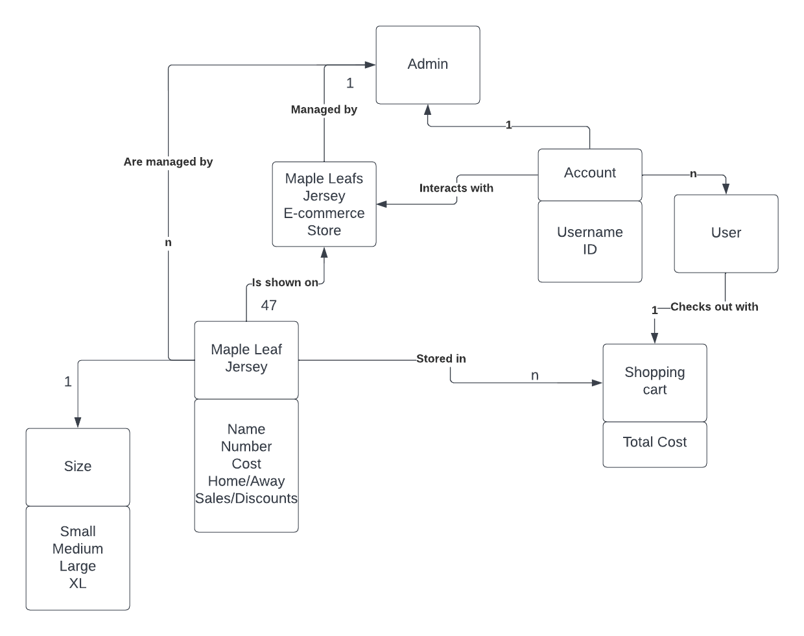

# PROJECT Design Documentation

## Team Information
* Team name: Toronto Maple Leafs
* Team members
  * Domenic Lo Iacono
  * Niccolls Evsseef
  * Claire Kreisel
  * Ming Creekmore

## Executive Summary

This project is a full stack application including a persistent storage, backend, and user interface. 
The goal of this application is to host a jersey store for the Toronto Maple Leafs. 
General features of the application include logging in and out, browsing the available jerseys for sale, and viewing individual jersey pages with all the jersey's attributes. 
There are two different accounts: admin and user. An admin is able to manage the site by adding and removing jerseys and editing existing jerseys. Users are able to add and remove items from their shopping cart and buy all the items in the cart.

### Purpose
This website has an admin that is able to modify the stock of jerseys that are for sale by adding jerseys, removing jerseys, and editing existing jerseys. 
The website also has users which have a username and a shopping cart which is persistent after logout. Users are able to add and remove items from their shopping cart. 

### Glossary and Acronyms

| Term | Definition |
|------|------------|
| Admin | Website owner with special privlidges related to the inventory of jerseys. |
| User | A customer that interacts with the website and has a username and shopping cart. |
| Jersey | The type of product that is being sold at the E-Store |
| SPA | Single Page |
| DAO | Data access object |

## Requirements

Requirements consisted of giving admin the ability to modify the inventory, allowing users to modify their shopping cart, and providing general viewing and browsing of the the jersey products in the store.

   

| Epic | Stories |
|------|------------|
| Admin Management | <ul><li>Login</li><li>Browse Products</li><li>Search Products</li><li>Edit Jerseys in Store</li><li>Add Jerseys to Store</li><li>Delete Jerseys From Store</li></ul> |
| User Interacting with Store | <ul><li>Login</li><li>Browse Products</li> <li>Search Products</li><li>Buyer Add/Remove from Cart</li><li>Buyer Save to Cart</li></ul> |
| Jersey in Store | <ul><li>View Jersey</li><li>Browse Products</li><li>Search Products</li><li>User: Jerseys Shown in Cart</li></ul> |

### Definition of MVP
The admin and users must be able to login. New users are able to register new accounts.
The admin must be able to preform CRUD operations on the stock of jerseys which is persistently stored.
The user must be able to add, delete, and checkout their shopping cart which also must be persistently stored. 
The website must allow quick and easy access to the products with a postive user experince. 

### MVP Features and the names of their stories
Admin management - allowing the admin to modify the inventory 
User interacting with store - allowing users to modify their shopping cart, as well as saving the shopping cart after logout 
Jerseys in the store - allowing any account to browse, search, and view jersey products

### Roadmap of Enhancements
> _Provide a list of top-level features in the order you plan to consider them._

## Application Domain

In the domain, it shows that the website has two different types of accounts that can interact with it: admin and user. There is only one admin. The admin manages the store and the jerseys. In contrast, there are many users who interact with the store by storing jerseys in their individual shopping cart. The user can check out with the shopping cart in order to buy the stored jersey items.

This is a Noun/Verb analysis relating to our domain model which is now represented in code through various classes. 

| Noun | Attributes |
|------|------------|
| Jerseys | <ul><li>Name</li><li>Number</li><li>Cost</li><li>Home/Away</li><li>Sales/Discounts/</li><li>Size: Small, Medium, Large, XL</li> |
| Store | |
| Account | <ul><li>Username</li><li>ID</li></ul>|
| Admin | |
| User | |
| Shopping Cart | <ul><li>Total Cost</li></ul> |

Verbs:
  <ul><li>Managed by</li><li>Are managed by</li><li>Interacts with</li><li>Checks out with</li><li>Is shown in</li><li>Is an attribute of</li><li>Stored in</li>

## Architecture and Design
The backend uses SpringBoot to build an API using a model-controller-DAOfile setup. The model holds the blueprint for an object, the DAOfile persistently stores and modifies data objects in a JSON file, and the controller allows outside clients to perform actions on the data. Jerseys and Users are both managed using this model-controller-DAOfile build. 

The frontend is built using angular. The jersey.service.ts and user.service.ts files are able to access the backend data and share the data to other files in the project. These parts are built using typescript. The typescript can then be used in the html to connect the backend data to the UI. CSS is added to the html to add aesthetics. 

### Summary

The following Tiers/Layers model shows a high-level view of the webapp's architecture.

The e-store web application, is built using the Model–View–ViewModel (MVVM) architecture pattern. 

The Model stores the application data objects including any functionality to provide persistance. 

The View is the client-side SPA built with Angular utilizing HTML, CSS and TypeScript. The ViewModel provides RESTful APIs to the client (View) as well as any logic required to manipulate the data objects from the Model.

Both the ViewModel and Model are built using Java and Spring Framework. Details of the components within these tiers are supplied below.

### Overview of User Interface

The user and admin have almost identical flows through the application. The user is only different than that of the admin by the fact that they are unable to see the CRUD operation buttons when viewing a jersey and that they have a shopping car.
Any person first lands on a login page when visiting the site. 
Upon login, after registration if neccessary, a user is directed to a page that displays the stock of jerseys that can be filtered using the search bar, a shopping cart icon, a logout icon, and the username of whoever is currently logged in. From here they are able to view jerseys and add them to their cart. They are also able to view their shopping cart and remove items from cart, or buy all the items in the cart.

As stated before, admin has an almost identical website experience as a user. The difference is that on the browsing jersey page, there is no shopping cart. Instead, there is a create jersey button. Furthermore, when viewing an individual jersey, they can edit or delete it. They cannot buy an individual jersey because they don't have a shopping cart.

### View Tier

Note: The app-components admin and browse-jersey are not used in the web-app. The components in the tier that are used include login, user, dashboard, search-jerseys, add-jersey, view-jersey, shopping-cart, and edit-jersey. 

Login is where the user is directed to when they first enter the website. It has a username and login screen with basic authentication. When the user is authenticated, then the app routes to the user component, which routes to the dashboard component. The dashboard component consists of the search-jerseys component, an add jersey button, a shopping cart button, and logout button. These buttons route to the respective component names. The search-jerseys component all jerseys that fit the filtered name, with spaces returning all jerseys. Each jersey name displayed, routes to that specific jerseys view-jersey page.

The view jersey page consists of the buttons: Back, Add to Cart, Update, and Delete. Update routes to edit-jersey component, then back to view-jersey. The shopping cart component consists of the buttons, Back and Buy.
The diagrams below show the high-end diagram of the view tier routing just described

### ViewModel Tier

This tier involves the interaction between the client and the server. The user will first interact with the website, which is the client. This results in the client giving a call to the API server, which returns a response entity. Based on the response entity the client will update the website view accordingly.

The client is composed of the angular components that represent each individual html page as well as the user and jersey service. The user and jersey service are what call the API. The API server is composed of the UserController and the JerseyController. The user parts deal with logging in the user and updating the shopping cart of the specified user. The jersey parts deal with updating the inventory.
Below are two sequence diagrams that show how the admin and user interact with the server and client. The user sequence diagram does not include logging in, searching jerseys, and viewing jerseys because it is the same as what is shown in the admin sequence diagram.

 

### Model Tier

> _Provide a summary of this tier of your architecture. This
> section will follow the same instructions that are given for the View
> Tier above._

> _At appropriate places as part of this narrative provide one or more
> static models (UML class diagrams) with some details such as critical attributes and methods._

### Static Code Analysis/Design Improvements

> _Discuss design improvements that you would make if the project were
> to continue. These improvement should be based on your direct
> analysis of where there are problems in the code base which could be
> addressed with design changes, and describe those suggested design
> improvements._

> _With the results from the Static Code Analysis exercise, 
> discuss the resulting issues/metrics measurements along with your analysis
> and recommendations for further improvements. Where relevant, include 
> screenshots from the tool and/or corresponding source code that was flagged._

## Testing

Testing was done using JaCoCo test coverage and JUnit tests. No testing was done on the UI component besides people going through the website. 

### Acceptance Testing
Acceptance criteria was made in the form GIVEN some precondition WHEN I do some action THEN I expect some result.
21 user stories have passed all their acceptance criteria tests. There are no stories that have failed tests, nor are there aany more stories on the product backlog.

### Unit Testing and Code Coverage

Unit testing was done by creating JUnit tests for each class. Each public method in a class was tested, where different branching routes of the method were tested via individual testing methods. Code coverage was calculated by JaCoCo. We selected a coverage target of 95% because we wanted most of the paths tested. The reason why it isn't 100% is because we felt that some of the paths added that we missed were part of the private methods that we didn't test and other paths tested instanceOf.
We were able to meet this code coverage result for persistence, model, and controller. Estore-API code coverage percentage was not met; it had a code coverage of 88%. This is because this was pre-provided for us and we didn't want to touch it.

